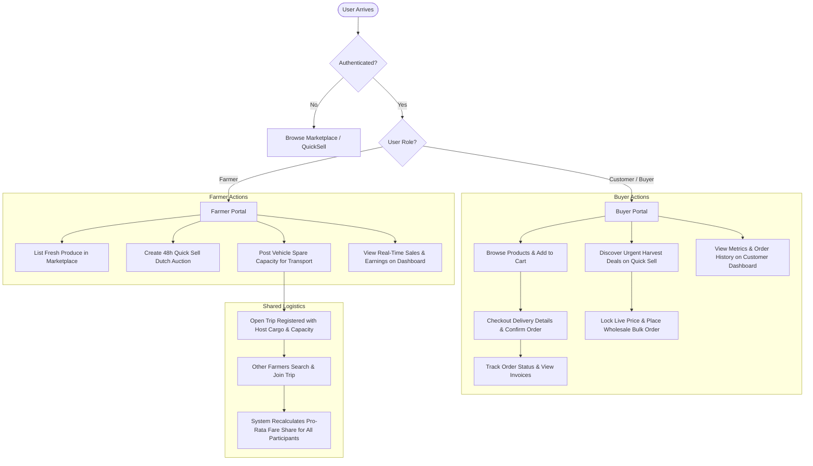
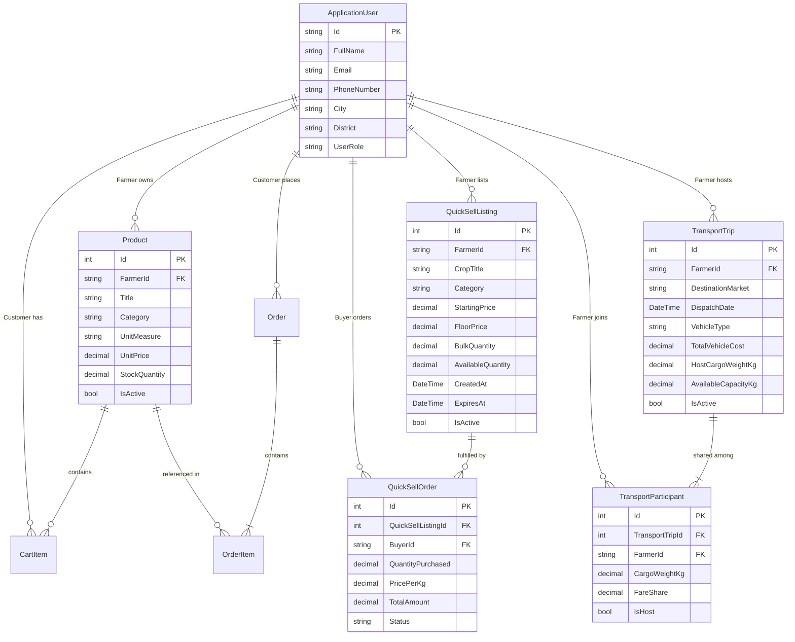

# 🌱 FarmGrid

> **Smart Direct-to-Consumer & B2B AgriTech Marketplace, 48-Hour Dutch Decay Engine, and Shared Farmer Logistics Platform**

FarmGrid bridges the gap between rural farmers, urban consumers, and commercial bulk buyers. It eliminates exploitative intermediaries, dramatically curtails post-harvest crop perishability losses through automated Dutch-auction price decay, and reduces rural transportation logistics costs through pooled vehicle transport.

---

## 📑 Table of Contents

- [Key Highlights](#-key-highlights)
- [System Architecture & Tech Stack](#-system-architecture--tech-stack)
- [End-to-End System Workflows](#-end-to-end-system-workflows)
  - [1. User Registration & Role Selection](#1-user-registration--role-selection)
  - [2. Marketplace & Retail Shopping Flow](#2-marketplace--retail-shopping-flow)
  - [3. Urgent Harvest Quick Sell (48h Dutch Decay Engine)](#3-urgent-harvest-quick-sell-48h-dutch-decay-engine)
  - [4. Shared Farmer Logistics & Vehicle Pooling](#4-shared-farmer-logistics--vehicle-pooling)
  - [5. Role-Specific Dashboards & Analytics](#5-role-specific-dashboards--analytics)
- [Architecture & Data Model](#-architecture--data-model)
- [Pre-Seeded Demo Accounts](#-pre-seeded-demo-accounts)
- [Local Development & Setup Guide](#-local-development--setup-guide)
- [Security & Access Control Matrix](#-security--access-control-matrix)

---

## 🌟 Key Highlights

### 1. 🛒 Direct Farmer-to-Consumer Marketplace
- **Direct Catalog**: Farmers list agricultural produce with custom unit measures (`kg`, `L`, `bunches`, `cobs`), real-time stock levels, pricing, and descriptions.
- **Search & Categorization**: Instant filtering by categories: **Vegetables**, **Fruits**, **Dairy Products**, and **Groceries**.
- **Shopping Cart & Checkout**: Atomic stock reservations, flexible delivery slot selection, cash on delivery or online payment, and automatic invoice generation.

### 2. ⚡ Quick Sell: 48-Hour Dynamic Dutch Auction Decay Engine
- **Surplus Crop Salvage**: Designed for perishable harvests (tomatoes, leafy greens, mangoes) that must sell before spoilage.
- **Continuous Algorithmic Price Decay**: The price smoothly drops every hour according to a strict mathematical curve:
  $$\text{CurrentPrice} = \max\left(\text{FloorPrice}, \text{StartPrice} - \left[\frac{\text{StartPrice} - \text{FloorPrice}}{48\text{ hrs}}\right] \times \text{ElapsedHours}\right)$$
- **Farmer Safety Net**: The price never drops below the farmer's guaranteed **Floor Price**.
- **Live Client Ticker**: Front-end JavaScript ticks down every second while synchronizing with the backend REST endpoint (`/api/quicksell/price/{id}`) to prevent race conditions.
- **Batch Presets**: Wholesale buyers can instantly lock in `25kg`, `50kg`, `100kg`, or entire lots with a single click.

### 3. 🚛 Smart Shared Logistics & Vehicle Pooling
- **Cost Sharing**: Farmers heading to mandis or urban distribution centers register spare vehicle capacity (e.g., Tata Ace, Bolero Maxi, Eicher).
- **Pro-Rata Fare Splitting**: Each farmer pays strictly in proportion to their cargo weight share:
  $$\text{FareShare} = \text{TotalVehicleCost} \times \left(\frac{\text{ParticipantCargoWeight}}{\text{CombinedCargoWeight}}\right)$$
- **Smart Trip Search**: Joining farmers query destination markets (e.g., *Central Mandi*, *City Hub*, *Wholesale Market*) by required payload capacity and date, with automatic nearby-date fallback matching.

### 4. 📊 Tailored Dashboards
- **Farmer Portal**: Real-time sales metrics, active catalog management, live quick sell monitors, retail & wholesale order logs, upcoming pooled trips.
- **Customer / B2B Portal**: Real-time order tracking, wholesale quick sell purchase history, expenditure statistics, and itemized invoice details.

---

## 🛠 System Architecture & Tech Stack

| Layer | Technologies |
| :--- | :--- |
| **Framework** | **ASP.NET Core 10 (MVC)**, C# 13 / .NET 10 |
| **Database & ORM** | **Microsoft SQL Server / LocalDB**, **Entity Framework Core 10** |
| **Identity & Security** | ASP.NET Core Identity, PBKDF2 Password Hashing, CSRF Anti-Forgery Tokens, Role-Based Access Control (RBAC) |
| **Frontend UI** | Razor Views, Bootstrap 5.3, Font Awesome 6.5, Responsive CSS3 Grid System |
| **Real-Time Client Logic** | Vanilla JavaScript, Asynchronous Fetch API, Live Ticker Clocks |

---

## 🔄 End-to-End System Workflows



### 1. User Registration & Role Selection
1. New users register at `/Account/Register`.
2. Choose one of three specialized roles:
   - **Farmer**: Grants access to produce listing, Quick Sell creation, vehicle pooling, and the Farmer Dashboard.
   - **Customer**: Grants access to retail shopping, cart, checkout, order history, and the Customer Dashboard.
   - **B2B Buyer**: Tailored for restaurants, distributors, and grocery stores looking for bulk produce deals on the Quick Sell marketplace.
3. Upon registration, the user is signed in and redirected to their role-appropriate dashboard or marketplace view.

### 2. Marketplace & Retail Shopping Flow
1. Users browse `/Products` with category filters (Vegetables, Fruits, Dairy, Groceries) and search queries.
2. Clicking **View Details** navigates to `/Products/Details/{id}` showing origin, description, price per unit, and live stock.
3. Customers add items to cart at `/Cart`, where quantities can be incremented, decremented, or removed.
4. Clicking **Proceed to Checkout** triggers `/Orders/Checkout`:
   - Delivery address, contact phone, and city are automatically pre-populated from the user's profile.
   - The user selects a delivery time slot (`6 AM - 9 AM`, `9 AM - 12 PM`, `4 PM - 7 PM`) and payment preference.
5. Submitting places the order atomically in a transaction, decrements available stock, empties the cart, and redirects to `/Orders`.
6. Customers can click **Invoice** at any time to open `/Orders/Details/{id}`, reviewing line items, delivery slot, and total billing.

### 3. Urgent Harvest Quick Sell (48h Dutch Decay Engine)
1. **Farmer Creation** (`/QuickSell/Create`):
   - Farmer enters crop title, category, starting price (e.g. ₹30/kg), floor price (e.g. ₹15/kg), and total bulk quantity (e.g. 500kg).
   - An interactive JavaScript preview demonstrates the exact price at 12h, 24h, 36h, and 48h marks.
2. **Dynamic Decay Execution**:
   - The listing stays active for strictly 48 hours.
   - The price decreases continuously every hour without manual intervention.
3. **Wholesale Purchase** (`/QuickSell/Details/{id}`):
   - Buyers watch the live countdown clock and current live price.
   - Clicking quick presets (`25kg`, `50kg`, `100kg`, or `All`) calculates estimated totals in real-time.
   - Submitting the purchase locks the server-side decay price, reserves stock, generates a confirmed `QuickSellOrder`, and updates the listing.

### 4. Shared Farmer Logistics & Vehicle Pooling
1. **Trip Creation** (`/Transport/Create`):
   - Host farmer schedules a trip specifying destination market (`Central Mandi`, `City Hub`, `Wholesale Market`), dispatch date, vehicle type, total rental cost (e.g. ₹3,500), host cargo payload, and spare capacity (e.g. 800kg).
   - System registers the host as the first participant with a 100% fare share.
2. **Trip Discovery** (`/Transport` & `/Transport/Suggestions`):
   - The Transport Hub displays upcoming open scheduled trips.
   - Farmers enter their destination market, date, and cargo weight to retrieve exact or nearby-date trip matches.
3. **Trip Pooling** (`/Transport/Join`):
   - The joining farmer enters their payload weight (validated against available capacity).
   - In an atomic transaction, capacity is decremented and the system recalculates each participant's fare share based on combined payload.
4. **Logistics Oversight** (`/Transport/MyTrips`):
   - Farmers view all trips they've hosted or joined, displaying their cargo weight and exact calculated fare share.

### 5. Role-Specific Dashboards & Analytics
- **Farmer Dashboard** (`/UI/FarmerDashboard`):
  - Overview cards: Active Products, Active Quick Sells, Total Combined Earnings, and Transport Trips.
  - Active Marketplace Products table with edit/stock management shortcuts.
  - 48-Hour Live Decay monitor displaying remaining time and live price.
  - Wholesale Quick Sell orders log.
  - Retail customer orders log.
  - Upcoming scheduled transport trips.
- **Customer Dashboard** (`/UI/CustomerDashboard`):
  - Overview cards: Active Orders, Total Orders Placed, and Total Purchases.
  - Retail Marketplace Orders with status badges (`Placed`, `Delivered`).
  - Wholesale Quick Sell Bulk purchases log.

---

## 🗄 Architecture & Data Model



---

## 👥 Pre-Seeded Demo Accounts

When the application starts, `DbInitializer.cs` automatically ensures database migrations are applied and provisions default accounts and realistic catalog data:

| Role | Email | Password | Full Name | Location |
| :--- | :--- | :--- | :--- | :--- |
| **Farmer** | `farmer@farmgrid.com` | `Farmer@123` | Ramesh Patel (Demo Farmer) | Anand, Gujarat |
| **Customer** | `customer@farmgrid.com` | `Customer@123` | Priya Sharma (Demo Customer) | Vadodara, Gujarat |
| **B2B Buyer** | `buyer@farmgrid.com` | `Buyer@123` | FreshMart Wholesale Co. | Ahmedabad, Gujarat |

*Note: You can also register any custom user account directly from the Register page.*

---

## 🚀 Local Development & Setup Guide

### Prerequisites
- [.NET 10.0 SDK](https://dotnet.microsoft.com/)
- [SQL Server](https://www.microsoft.com/sql-server) or **SQL Server LocalDB** (included with Visual Studio)

### 1. Clone the Repository
```bash
git clone https://github.com/aaravv28/FarmGrid.git
cd FarmGrid
```

### 2. Configure Database Connection
Review `appsettings.json` to verify the connection string:
```json
{
  "ConnectionStrings": {
    "DefaultConnection": "Server=(localdb)\\mssqllocaldb;Database=aspnet-FarmGrid-f7517bf2-33d0-4a24-b3fd-472a409ba555;Trusted_Connection=True;MultipleActiveResultSets=true"
  }
}
```

### 3. Build & Run
```bash
dotnet restore
dotnet build
dotnet run
```

On application boot, `DbInitializer` will automatically:
1. Apply all Entity Framework Core migrations to your SQL Server database.
2. Seed the Identity roles (`Farmer`, `Customer`, `B2B Buyer`).
3. Seed the demo user credentials.
4. Seed active marketplace produce across Vegetables, Fruits, Groceries, and Dairy.
5. Seed scheduled transport pooling trips and active Quick Sell listings.

Open your browser and navigate to:
```
http://localhost:5086
```

---

## 🛡 Security & Access Control Matrix

| Controller / Route | Action | Public / Guest | Customer | B2B Buyer | Farmer |
| :--- | :--- | :---: | :---: | :---: | :---: |
| **Home** (`/`) | Index, Privacy | ✅ | ✅ | ✅ | ✅ |
| **Products** (`/Products`) | Catalog Index, Details | ✅ | ✅ | ✅ | ✅ |
| **Products** (`/Products`) | Create, Edit, Delete | ❌ | ❌ | ❌ | ✅ |
| **Cart** (`/Cart`) | View Cart, Add, Update, Remove | ❌ | ✅ | ✅ | ❌ |
| **Orders** (`/Orders`) | Checkout, My Orders, Details | ❌ | ✅ | ✅ | ❌ |
| **QuickSell** (`/QuickSell`) | Marketplace Index, Details | ✅ | ✅ | ✅ | ✅ |
| **QuickSell** (`/QuickSell`) | Create Quick Sell | ❌ | ❌ | ❌ | ✅ |
| **QuickSell** (`/QuickSell`) | Purchase Bulk Deal | ❌ | ✅ | ✅ | ❌ |
| **Transport** (`/Transport`) | Index, Suggestions, Create, Join, MyTrips | ❌ | ❌ | ❌ | ✅ |
| **Dashboard** (`/UI/FarmerDashboard`) | Farmer Operations & Sales | ❌ | ❌ | ❌ | ✅ |
| **Dashboard** (`/UI/CustomerDashboard`) | Buyer Purchases & Tracking | ❌ | ✅ | ✅ | ❌ |
| **Account** (`/Account`) | Login, Register | ✅ | ❌ *(Redirect)* | ❌ *(Redirect)* | ❌ *(Redirect)* |
| **Account** (`/Account`) | Profile, Logout | ❌ | ✅ | ✅ | ✅ |

---

## 📜 License

This project is licensed under the [MIT License](LICENSE).
