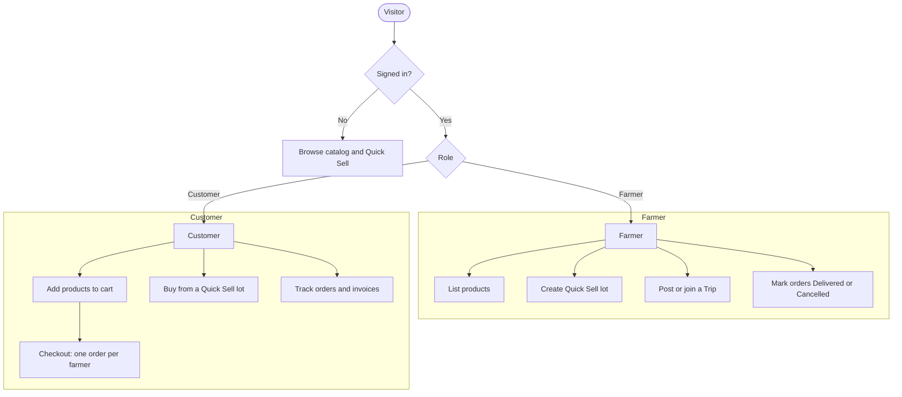
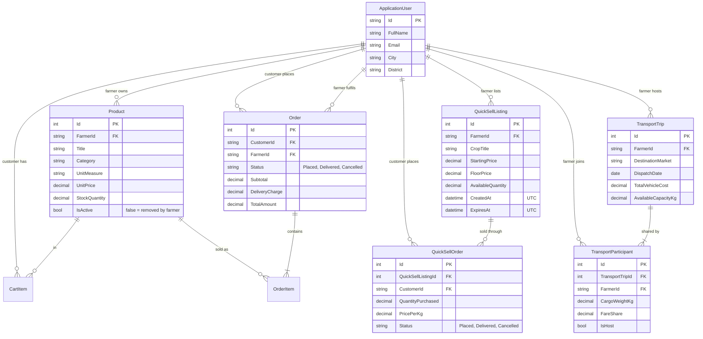

# 🌱 FarmGrid

> **A farmer-to-customer produce marketplace, with Quick Sell surplus clearance and shared transport for farmers**

FarmGrid connects farmers directly with customers. Farmers list produce in a catalog, clear perishable surplus through **Quick Sell** lots whose price falls steadily over 48 hours, and share vehicles to market through pooled **Trips**, splitting the cost by cargo weight.

There are two roles: **Farmer** and **Customer**. The domain vocabulary is defined in [CONTEXT.md](CONTEXT.md).

---

## 📑 Table of Contents

- [Key Features](#-key-features)
- [Tech Stack](#-tech-stack)
- [Workflows](#-workflows)
  - [1. Registration and Roles](#1-registration-and-roles)
  - [2. Catalog, Cart and Checkout](#2-catalog-cart-and-checkout)
  - [3. Order Status](#3-order-status)
  - [4. Quick Sell (Surplus Clearance)](#4-quick-sell-surplus-clearance)
  - [5. Shared Transport](#5-shared-transport)
  - [6. Dashboards](#6-dashboards)
- [Data Model](#-data-model)
- [Demo Accounts](#-demo-accounts)
- [Local Development](#-local-development)
- [Access Control](#-access-control)
- [License](#-license)

---

## 🌟 Key Features

### 🛒 Farmer-to-Customer Catalog
- Farmers list produce with a unit (`kg`, `L`, `dozen`, `bunch`, `piece`), price and stock. Dozen, bunch and piece are sold in whole numbers only.
- Categories: **Vegetables**, **Fruits**, **Dairy Products** and **Groceries**, shared by the catalog and Quick Sell.
- Only products that are listed **and in stock** are shown. A sold-out product reappears automatically when restocked.
- A cart with produce from several farmers becomes **one order per farmer** at checkout, each with its own ₹30 delivery charge.
- **Cash on Delivery** is the only payment method.

### ⚡ Quick Sell: Surplus Clearance
- For perishable surplus that must sell fast. A farmer sets a starting price and a floor price for a lot; the price falls in a straight line over 48 hours and never goes below the floor:

  $$\text{CurrentPrice} = \max\left(\text{FloorPrice},\ \text{StartPrice} - \frac{\text{StartPrice} - \text{FloorPrice}}{48} \times \text{ElapsedHours}\right)$$

- The server is the only source of the price. The lot page shows the server's price, refreshed every 15 seconds, and a customer is **never charged more than the price they were shown**.
- Quick quantity presets (25 / 50 / 100 kg or everything left). The minimum order is 1 kg, except when buying the last of a lot.

### 🚛 Shared Transport
- A farmer heading to a market posts a **Trip** with spare capacity. Other farmers join with their cargo.
- The vehicle cost is split by cargo weight, rounded to the paisa, and always adds up to exactly the total (the host absorbs any rounding):

  $$\text{FareShare} = \text{TotalVehicleCost} \times \frac{\text{ParticipantCargoKg}}{\text{CombinedCargoKg}}$$

- A Trip is open through its dispatch date (India time) and closes after it.

### 📊 Dashboards
- **Farmer:** own products, Quick Sell lots, catalog and Quick Sell orders (with Delivered / Cancel actions), earnings and trips.
- **Customer:** orders, Quick Sell purchases, active orders and total spend.

---

## 🛠 Tech Stack

| Layer | Technologies |
| :--- | :--- |
| **Framework** | ASP.NET Core 10 MVC, C# 14 / .NET 10 |
| **Data** | SQL Server / LocalDB, Entity Framework Core 10 |
| **Identity** | ASP.NET Core Identity (roles, lockout after 5 failed logins), anti-forgery tokens |
| **UI** | Razor views, Bootstrap 5.3, Font Awesome 6.5 |
| **Tests** | xUnit, EF Core SQLite (in-memory), `FakeTimeProvider` |

Times are stored in **UTC** and shown in **India Standard Time**. The app's culture is fixed to `en-IN`.

---

## 🔄 Workflows



### 1. Registration and Roles
1. Register at `/Account/Register` as a **Farmer** or a **Customer**.
2. After registering, farmers land on their dashboard and customers on the home page.
3. Logging in sends each role to its dashboard. Five wrong passwords lock an account for 15 minutes, and the login form never reveals whether an email has an account.

### 2. Catalog, Cart and Checkout
1. Browse `/Products` by category or search. Product pages show the farmer's name.
2. Customers add products to the cart at `/Cart`. Signed-out visitors see **Sign in to buy**, which brings them back to the product.
3. The cart flags any line that can no longer be bought (removed, sold out, not enough stock) and blocks checkout until it is fixed.
4. `/Orders/Checkout` pre-fills delivery details from the profile, shows items and delivery grouped by farmer, and places **one order per farmer** in a single transaction, decrementing stock.
5. `/Orders` lists orders; `/Orders/Details/{id}` is the invoice. Catalog orders are numbered `#FG0001`, Quick Sell orders `#QS0001`.

### 3. Order Status
- Every order starts as **Placed** and moves to **Delivered** or **Cancelled**. Both are final.
- Only the **farmer who owns the order** can change its status, from the farmer dashboard. Customers cannot cancel.
- Cancelling returns the quantity to the product's stock (or to the Quick Sell lot). Cancelled orders don't count towards earnings or spend.

### 4. Quick Sell (Surplus Clearance)
1. **Create** (`/QuickSell/Create`, farmers): crop, category, lot quantity, starting and floor price. A preview shows the price at 12, 24, 36 and 48 hours.
2. **Browse** (`/QuickSell`): lots that are listed, have quantity left and haven't expired, soonest-closing first.
3. **Buy** (`/QuickSell/Details/{id}`, customers): the page shows the live server price and a countdown. The order is charged the server's price at that moment, which is never higher than the price shown.
4. Lot pages show **SOLD OUT** or **EXPIRED** when buying is closed. The live price API is `/api/quicksell/price/{id}`.

### 5. Shared Transport
1. **Create** (`/Transport/Create`): destination market, dispatch date (today or later), vehicle, total cost, host cargo and spare capacity. The host is the first participant.
2. **Find** (`/Transport/Suggestions`): search by market, date and cargo weight. Trips you host or have already joined are left out. If nothing leaves on that date, nearby dates are offered, clearly marked.
3. **Join** (`/Transport/Join`): capacity is checked and reserved, and every participant's fare share is recalculated. A farmer can join a trip once.
4. **My Trips** (`/Transport/MyTrips`): trips you host or joined, labelled **Upcoming** or **Closed**, with your fare share.

### 6. Dashboards
- **Farmer** (`/UI/FarmerDashboard`): products (with Low Stock, Out of Stock and Removed badges), Quick Sell lots (Live, Sold Out, Expired), orders with Delivered / Cancel buttons, earnings and trips.
- **Customer** (`/UI/CustomerDashboard`): orders and Quick Sell purchases with their status, active order count and total spend.

---

## 🗄 Data Model

Owner and customer ids are foreign keys to users, so every product, lot, trip and order belongs to a real account.



Stock, lot quantity, trip capacity and order status are optimistic-concurrency tokens, so two simultaneous purchases can't oversell and an order can't be cancelled twice.

---

## 👥 Demo Accounts

On startup, `DbInitializer` applies migrations and creates these accounts with demo catalog data:

| Role | Email | Password | Name | Location |
| :--- | :--- | :--- | :--- | :--- |
| **Farmer** | `farmer@farmgrid.com` | `Farmer@123` | Ramesh Patel (Demo Farmer) | Anand, Gujarat |
| **Customer** | `customer@farmgrid.com` | `Customer@123` | Priya Sharma (Demo Customer) | Vadodara, Gujarat |

In Development, fresh demo Quick Sell lots and trips are added whenever none are live, so the demo never goes empty.

---

## 🚀 Local Development

### Prerequisites
- [.NET 10 SDK](https://dotnet.microsoft.com/)
- SQL Server or **SQL Server LocalDB** (included with Visual Studio)

### Run
```bash
git clone https://github.com/aaravv28/FarmGrid.git
cd FarmGrid
dotnet tool restore      # installs dotnet-ef (repo-local tool)
dotnet run
```

The connection string is in `appsettings.json` (`DefaultConnection`, LocalDB by default). On startup the app applies all migrations, creates the roles and demo accounts, and seeds demo data. Then open the URL printed in the console (e.g. `http://localhost:5086`).

### Test
```bash
dotnet test FarmGrid.slnx
```

Tests run against an in-memory SQLite database per test, with a fake clock where time matters.

### Migrations
```bash
dotnet ef migrations add <Name> --project FarmGrid.csproj
```

The schema is a single `InitialCreate` migration. To start over with an empty database (demo data is re-seeded on the next run): `dotnet ef database drop --project FarmGrid.csproj`.

---

## 🛡 Access Control

| Area | Action | Visitor | Customer | Farmer |
| :--- | :--- | :---: | :---: | :---: |
| **Home** (`/`) | Home, Privacy | ✅ | ✅ | ✅ |
| **Products** (`/Products`) | Catalog, Details | ✅ | ✅ | ✅ |
| **Products** | Create | ❌ | ❌ | ✅ |
| **Products** | Edit, Delete | ❌ | ❌ | ✅ own only |
| **Cart** (`/Cart`) | View, Add, Update, Remove | ❌ | ✅ | ❌ |
| **Orders** (`/Orders`) | Checkout, My Orders, Invoice | ❌ | ✅ | ❌ |
| **Order status** (`/FarmerOrders`) | Deliver, Cancel | ❌ | ❌ | ✅ own orders only |
| **Quick Sell** (`/QuickSell`) | Browse, Details | ✅ | ✅ | ✅ |
| **Quick Sell** | Create lot | ❌ | ❌ | ✅ |
| **Quick Sell** | Buy | ❌ | ✅ | ❌ |
| **Transport** (`/Transport`) | Hub, Create, Suggestions, Join, My Trips | ❌ | ❌ | ✅ |
| **Dashboards** (`/UI`) | Farmer Dashboard | ❌ | ❌ | ✅ |
| **Dashboards** | Customer Dashboard | ❌ | ✅ | ❌ |
| **Account** (`/Account`) | Login, Register | ✅ | redirect | redirect |
| **Account** | Profile, Logout | ❌ | ✅ | ✅ |

---

## 📜 License

Intended to be released under the MIT License. A `LICENSE` file has not been added to the repository yet.
